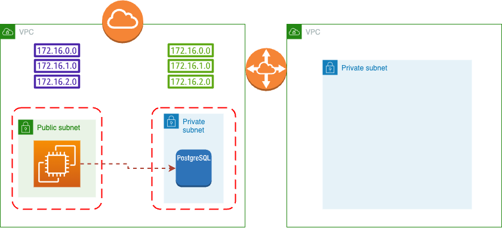

## Integration Application

Sample terraform application for client-facing analytics.

Basic application infrastructure looks as follows:


Everything is described in `terraform`-folder.

To run this in your own AWS space do follows:

```shell
cd terraform
terraform init
terraform apply -var-file=env.tfvars -var="my_ip=$(curl -4 ifconfig.me)"
```

Inside `env.tfvars` consist main argument that used inside module, default one:

```terraform
db_password = "Password"
db_username = "chinook_admin"
```

Final goal is extract data from private Postgresql, to feed postgresql with test data see readme in [here](./loadgen)

# Stage 2: Create and connect with Data VPC



First thing first - connectivity. For that we need to connect double-cloud via [BYOA](https://double.cloud/docs/en/vpc/connect-dc-to-aws)

