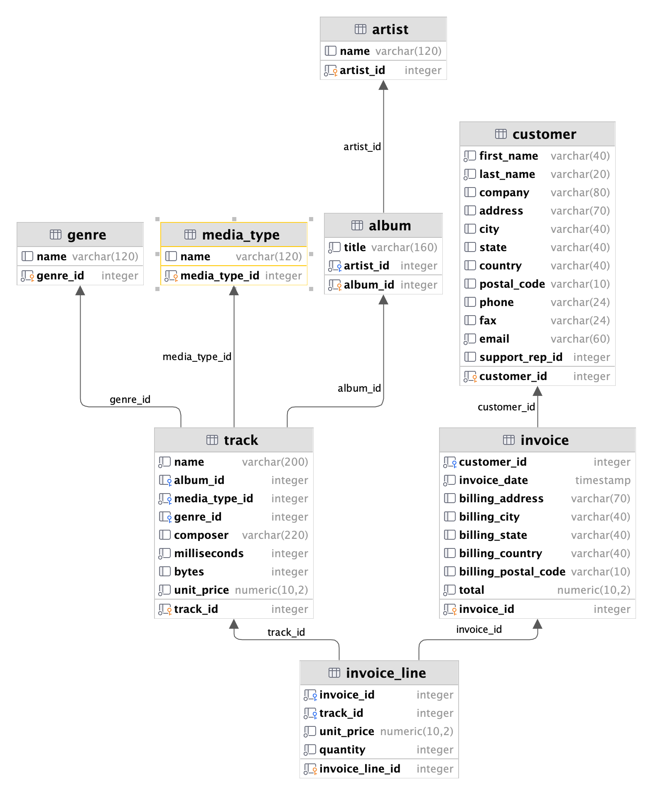

Based on [this](https://github.com/morenoh149/postgresDBSamples/blob/master/chinook-1.4/Chinook_PostgreSql_utf8.sql) dataset.

Schema of database:



It will generate 2 separate loads:

1. Track generation, will generate hipster named album for exist or new singer (70% probability)
2. Will sell a bunch of track to customer

This load gen happens with random delay from 0.1 to 2 seconds. As parametrs of CLI we can specify a speed, it will simply enlarge our delay X-times.

Basic usage:

```shell
chinookloadgen --dsn="host=chinook.RANDOM_AWS_ID.eu-west-2.rds.amazonaws.com port=5432 user=chinook_admin dbname=chinook password=Passowrd" --speed=1
```

